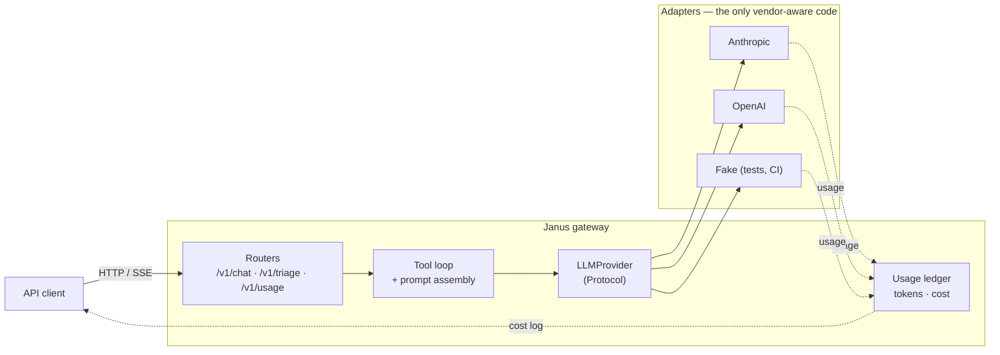

# Janus 🚪

> *Two faces, one door.*

**A provider-agnostic LLM gateway.** Claude and GPT behind a single API, with
SSE streaming, tool calling, schema-constrained outputs, prompt caching, and a
cost figure attached to every request.

Janus was the Roman god of doorways and transitions, depicted with two faces
looking in opposite directions. The name is the architecture: one entrance, two
vendors behind it, and business code that cannot tell which one it is talking to.

> Personal portfolio project by [Juan Camilo Mendoza](https://github.com/JuanCamiloMendoza99).
> Companion to [Veridex](https://github.com/JuanCamiloMendoza99/veridex), which covers
> the retrieval half of AI engineering; this one covers the production half —
> provider portability, streaming, observability and unit economics.

## Why this exists

Calling an LLM API is easy. The parts that are not easy, and that this project is
built to demonstrate:

- **You cannot swap providers if a vendor SDK type has leaked into your domain.**
  Janus defines its own model and translates at the edges, so `LLM_PROVIDER=openai`
  is a config change and nothing else.
- **You cannot control spend you cannot see.** Every request logs its token usage
  and cost — including streamed requests, where the tokens arrive *after* the
  response has already started.
- **Prompt caching fails silently.** Below a per-model token floor the API accepts
  your cache marker and caches nothing. The only proof it works is a measured
  cache hit, which is why cache hit rate is a first-class metric here.

## Architecture



**How it works:**

1. **One seam.** `LLMProvider` is a `typing.Protocol`. Routers and the tool loop
   depend on it and on a vendor-neutral domain model; nothing above the seam
   imports an SDK.
2. **Streaming is normalized.** Each vendor's stream is translated into four
   event types — `TextDelta`, `ToolCallRequested`, `UsageReport`, `Done` — so the
   SSE layer has four cases regardless of who answered.
3. **Caching is modelled as stability.** A `Prompt` separates its byte-stable
   `cacheable_prefix` from everything volatile, because caching is a prefix match
   and one changed byte invalidates the rest.
4. **Cost is accumulated per request.** A ledger in a `ContextVar` collects every
   model call — a tool-using request makes several — and is flushed when the
   response body completes, not when the handler returns.

Every one of those decisions, and what it cost, is recorded in
[`docs/architecture.md`](docs/architecture.md).

## Tech Stack

| Layer | Technology |
|---|---|
| API | FastAPI + Uvicorn (Python 3.12) |
| Streaming | Server-sent events (`sse-starlette`) |
| Providers | Anthropic SDK, OpenAI SDK — no orchestration framework |
| Validation | Pydantic v2 (request, domain, and model-constrained output) |
| Config | pydantic-settings |
| Tooling | ruff, pytest |

**No LangChain, no LlamaIndex.** The point of the project is to demonstrate the
underlying mechanics — tool loops, stream normalization, cache placement, token
accounting — which a framework would hide.

## Quickstart

```bash
# 1. Configure
cp .env.example .env

# 2. Install
python -m venv .venv && . .venv/bin/activate   # Windows: .\.venv\Scripts\Activate.ps1
pip install -e ".[dev]"

# 3. Run
uvicorn app.main:app --reload

# 4. Verify
curl http://localhost:8000/health
# {"status":"ok","provider":"fake","model":"fake-1",...}
```

It runs with **no API keys at all**: the default `LLM_PROVIDER=fake` is a real
implementation of the provider seam that makes no network calls. Set a key and
switch the variable to talk to a real vendor.

Interactive API docs: <http://localhost:8000/docs>

## Endpoints

| Method | Path | Notes |
|---|---|---|
| `POST` | `/v1/chat` | Streaming chat with tool calling. Returns SSE: `delta`, `tool_call`, `usage`, `done` |
| `POST` | `/v1/triage` | Classifies a support ticket into a schema-validated `TriageResult`. Not streamed — the consumer is a system, and half a JSON object is useless to it |
| `GET` | `/v1/usage` | Spend, token totals and cache hit rate since process start |
| `GET` | `/health` | Liveness, plus which provider and model are wired in |

## Switching providers

The project's central claim, and how to check it:

```bash
LLM_PROVIDER=fake      uvicorn app.main:app   # no credentials, no spend
LLM_PROVIDER=anthropic uvicorn app.main:app
LLM_PROVIDER=openai    uvicorn app.main:app
```

Same requests, same responses, same client. `/health` reports which vendor
answered. No application code differs between the three.

## Tool calling

`POST /v1/chat` runs a real tool loop: call the model, run whatever tools it
asked for, hand back every result, ask again — until it answers or hits
`TOOL_LOOP_MAX_ITERATIONS` (default 5, because every iteration is a paid model
call).

| Tool | Kind | What it does |
|---|---|---|
| `search_kb` | read | Keyword search over a small in-repo corpus of support articles. Deliberately not a vector index — the sibling [Veridex](https://github.com/JuanCamiloMendoza99/veridex) project covers retrieval, and a second worse RAG system here would add nothing |
| `escalate_ticket` | write | Records an escalation and confirms it. Idempotent by ticket id: a model that repeats itself does not page a second human |

One read tool and one write tool on purpose — they exercise different halves of
the loop. A read tool tolerates a speculative call; a write tool does not.

The stream reflects the whole exchange rather than a single call:

```
event: tool_call  data: {"id":"...","name":"search_kb","arguments":{"query":"..."}}
event: usage      data: {"input_tokens":84,"output_tokens":89,"cache_read_tokens":0,
                         "cache_write_tokens":2117,"cost_usd":0.00952575}
event: delta      data: {"text":"..."}
event: usage      data: {"input_tokens":537,"output_tokens":1422,"cache_read_tokens":2117,
                         "cache_write_tokens":0,"cost_usd":0.0235761}
event: done       data: {"stop_reason":"end_turn"}
```

Those are real numbers from a `claude-sonnet-5` run, and they show three things
at once. `tool_call` frames are emitted as each call is assembled, so a client
can show what the assistant is doing instead of freezing for the length of a tool
turn. **Each model call reports its own `usage`** — a tool-using request costs
several, and hiding that would make the cost figure a lie. And all four token
counts are present, so `cost_usd` is reconcilable from the frame: the first
call's cost is 83% cache-write, which a frame reporting only input and output
tokens would leave unexplainable. Set `use_tools:false` to disable tools for a
single request.

Two details that are easy to get wrong and are covered by tests: every result of
a turn goes back in **one** message (splitting them trains the model out of
parallel calls), and a tool failure comes back as a readable error result rather
than an exception (an unpaired tool call is rejected outright by both vendors).
See ADR-007.

## Cost accounting

Every request emits one structured log line with its token usage and cost, and
`GET /v1/usage` aggregates them. Pricing lives in one dated, versioned table
([`app/core/pricing.py`](app/core/pricing.py)) rather than as constants scattered
through the adapters — a cost number is only as trustworthy as the table behind it.

`cache_hit_rate` is the metric worth watching. Prompt caching is configured with
a flag but *proven* only by a nonzero cache read on a repeated request; a hit rate
of zero means the feature is doing nothing regardless of what the config says.

## Testing

```bash
pytest                          # full suite — no credentials, no network, no spend
ruff check . && ruff format --check .
```

The suite runs against `FakeProvider`, a first-class implementation of the
provider seam rather than a mock. That is why CI needs no secrets and works on a
fork.

Tests that hit a real vendor are marked `live` and excluded by default —
they cost money.

## Project Structure

```
app/
├── main.py           # FastAPI entrypoint + /health
├── core/             # Settings, logging, pricing table
├── api/              # Routers (thin) + HTTP schemas
├── providers/        # base.py = the seam; anthropic / openai / fake adapters
├── domain/           # TriageResult + the cacheable support playbook
├── services/         # Prompt assembly + the tool loop
├── tools/            # Tool specs, handlers, dispatch and the KB corpus
└── observability/    # Usage ledger + cost middleware
tests/                # Pytest — runs entirely on the fake provider
docs/architecture.md  # ADRs (append-only)
docs/plans/           # Per-phase implementation plans
```

Start with [`app/providers/base.py`](app/providers/base.py) — it is the load-bearing
module, and every other design decision follows from it.

## Roadmap

Each phase has an implementation-ready plan in [`docs/plans/`](docs/plans/README.md).

- [x] **Phase 0 — Infrastructure & contracts**: provider seam, domain model, ADRs, CI
- [x] **[Phase 1 — Provider seam & streaming](docs/plans/phase-1-provider-seam.md)**: both real adapters, SSE, per-request cost log
- [ ] **[Phase 2 — Tool calling](docs/plans/phase-2-tool-calling.md)**: the tool loop, normalized across vendors *(implemented; live acceptance against real vendors pending)*
- [ ] **[Phase 3 — Structured outputs & caching](docs/plans/phase-3-structured-and-caching.md)**: `/v1/triage`, prompt caching proven by measurement
- [ ] **[Phase 4 — Evaluation](docs/plans/phase-4-evals.md)**: which provider to actually pay for — cost, latency and accuracy on a golden dataset
- [ ] **[Phase 5 — Prompt engineering & optimization](docs/plans/phase-5-prompt-optimization.md)**: which prompt to ship — versioned playbook variants, A/B'd on the golden set, with LLM-as-judge for the free-text fields

## Current status

**Phase 1 — done.** Both real adapters (Anthropic and OpenAI), SSE streaming on
`/v1/chat`, the per-request cost ledger and `/v1/usage`, verified against both
live APIs. The defaults are each vendor's mid tier — `claude-sonnet-5` and
`gpt-5.6-terra` — with model ids and rates verified against the vendors' pricing
pages on 2026-07-20.

**Phase 2 — implemented, live acceptance pending.** The tool loop, `search_kb`
and `escalate_ticket`, tool calling in both adapters, and `tool_call` SSE frames
are in place; the suite is green on the `FakeProvider` and ruff is clean. What
the fake cannot prove is whether a real model *chooses* the right tool, so the
phase's acceptance run — a duplicate-charge ticket against `LLM_PROVIDER=anthropic`
and `openai`, expecting a `search_kb` call and a grounded answer — is still
outstanding.

## License

[MIT](LICENSE)
