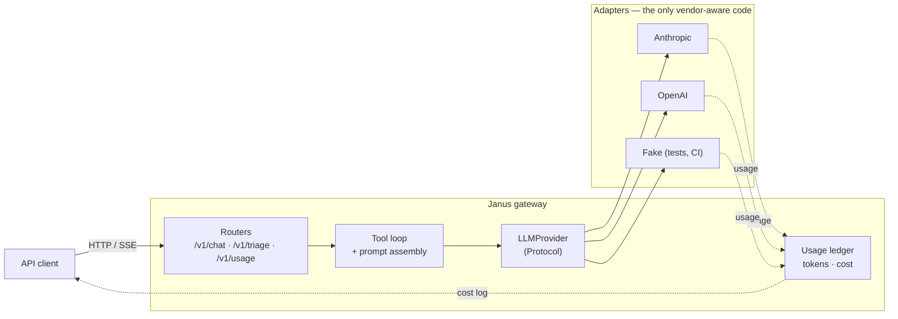
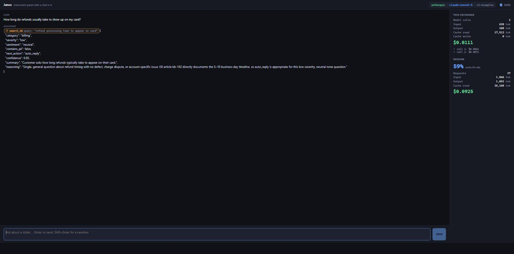

# Janus 🚪

> *Two faces, one door.*

**A provider-agnostic LLM gateway.** Claude and GPT behind a single API, with
SSE streaming, tool calling, schema-constrained outputs, prompt caching, and a
cost figure attached to every request.

Janus was the Roman god of doorways and transitions, depicted with two faces
looking in opposite directions. The name is the architecture: one entrance, two
vendors behind it, and business code that cannot tell which one it is talking to.

> Personal portfolio project by [Juan Camilo Mendoza](https://github.com/JuanCamiloMendoza99).
> Companion to [Veridex](https://github.com/JuanCamiloMendoza99/veridex), which covers
> the retrieval half of AI engineering; this one covers the production half —
> provider portability, streaming, observability and unit economics.

## Why this exists

Calling an LLM API is easy. The parts that are not easy, and that this project is
built to demonstrate:

- **You cannot swap providers if a vendor SDK type has leaked into your domain.**
  Janus defines its own model and translates at the edges, so `LLM_PROVIDER=openai`
  is a config change and nothing else.
- **You cannot control spend you cannot see.** Every request logs its token usage
  and cost — including streamed requests, where the tokens arrive *after* the
  response has already started.
- **Prompt caching fails silently.** Below a per-model token floor the API accepts
  your cache marker and caches nothing. The only proof it works is a measured
  cache hit, which is why cache hit rate is a first-class metric here.

## Architecture



**How it works:**

1. **One seam.** `LLMProvider` is a `typing.Protocol`. Routers and the tool loop
   depend on it and on a vendor-neutral domain model; nothing above the seam
   imports an SDK.
2. **Streaming is normalized.** Each vendor's stream is translated into four
   event types — `TextDelta`, `ToolCallRequested`, `UsageReport`, `Done` — so the
   SSE layer has four cases regardless of who answered.
3. **Caching is modelled as stability.** A `Prompt` separates its byte-stable
   `cacheable_prefix` from everything volatile, because caching is a prefix match
   and one changed byte invalidates the rest.
4. **Cost is accumulated per request.** A ledger in a `ContextVar` collects every
   model call — a tool-using request makes several — and is flushed when the
   response body completes, not when the handler returns.

Every one of those decisions, and what it cost, is recorded in
[`docs/architecture.md`](docs/architecture.md).

## Tech Stack

| Layer | Technology |
|---|---|
| API | FastAPI + Uvicorn (Python 3.12) |
| Streaming | Server-sent events (`sse-starlette`) |
| Providers | Anthropic SDK, OpenAI SDK — no orchestration framework |
| Validation | Pydantic v2 (request, domain, and model-constrained output) |
| Config | pydantic-settings |
| Tooling | ruff, pytest |

**No LangChain, no LlamaIndex.** The point of the project is to demonstrate the
underlying mechanics — tool loops, stream normalization, cache placement, token
accounting — which a framework would hide.

## Quickstart

```bash
# 1. Configure
cp .env.example .env

# 2. Install
python -m venv .venv && . .venv/bin/activate   # Windows: .\.venv\Scripts\Activate.ps1
pip install -e ".[dev]"

# 3. Run
uvicorn app.main:app --reload

# 4. Verify
curl http://localhost:8000/health
# {"status":"ok","provider":"fake","model":"fake-1",...}
```

It runs with **no API keys at all**: the default `LLM_PROVIDER=fake` is a real
implementation of the provider seam that makes no network calls. Set a key and
switch the variable to talk to a real vendor.

Interactive API docs: <http://localhost:8000/docs>

## Endpoints

| Method | Path | Notes |
|---|---|---|
| `POST` | `/v1/chat` | Streaming chat with tool calling. Returns SSE: `delta`, `tool_call`, `usage`, `done` |
| `POST` | `/v1/triage` | Classifies a support ticket into a schema-validated `TriageResult`. Not streamed — the consumer is a system, and half a JSON object is useless to it |
| `GET` | `/v1/usage` | Spend, token totals and cache hit rate since process start |
| `GET` | `/health` | Liveness, plus which provider and model are wired in |

## Switching providers

The project's central claim, and how to check it:

```bash
LLM_PROVIDER=fake      uvicorn app.main:app   # no credentials, no spend
LLM_PROVIDER=anthropic uvicorn app.main:app
LLM_PROVIDER=openai    uvicorn app.main:app
```

Same requests, same responses, same client. `/health` reports which vendor
answered. No application code differs between the three.

## Tool calling

`POST /v1/chat` runs a real tool loop: call the model, run whatever tools it
asked for, hand back every result, ask again — until it answers or hits
`TOOL_LOOP_MAX_ITERATIONS` (default 5, because every iteration is a paid model
call).

| Tool | Kind | What it does |
|---|---|---|
| `search_kb` | read | Keyword search over a small in-repo corpus of support articles. Deliberately not a vector index — the sibling [Veridex](https://github.com/JuanCamiloMendoza99/veridex) project covers retrieval, and a second worse RAG system here would add nothing |
| `escalate_ticket` | write | Records an escalation and confirms it. Idempotent by ticket id: a model that repeats itself does not page a second human |

One read tool and one write tool on purpose — they exercise different halves of
the loop. A read tool tolerates a speculative call; a write tool does not.

The stream reflects the whole exchange rather than a single call:

```
event: tool_call  data: {"id":"...","name":"search_kb","arguments":{"query":"..."}}
event: usage      data: {"input_tokens":84,"output_tokens":89,"cache_read_tokens":0,
                         "cache_write_tokens":2117,"cost_usd":0.00952575}
event: delta      data: {"text":"..."}
event: usage      data: {"input_tokens":537,"output_tokens":1422,"cache_read_tokens":2117,
                         "cache_write_tokens":0,"cost_usd":0.0235761}
event: done       data: {"stop_reason":"end_turn"}
```

Those are real numbers from a `claude-sonnet-5` run, and they show three things
at once. `tool_call` frames are emitted as each call is assembled, so a client
can show what the assistant is doing instead of freezing for the length of a tool
turn. **Each model call reports its own `usage`** — a tool-using request costs
several, and hiding that would make the cost figure a lie. And all four token
counts are present, so `cost_usd` is reconcilable from the frame: the first
call's cost is 83% cache-write, which a frame reporting only input and output
tokens would leave unexplainable. Set `use_tools:false` to disable tools for a
single request.

Two details that are easy to get wrong and are covered by tests: every result of
a turn goes back in **one** message (splitting them trains the model out of
parallel calls), and a tool failure comes back as a readable error result rather
than an exception (an unpaired tool call is rejected outright by both vendors).
See ADR-007.

## Structured outputs

`POST /v1/triage` classifies a support ticket into a
[`TriageResult`](app/domain/triage.py) — category, severity, sentiment, next
action, a PII flag, a confidence score and a one-line summary:

```bash
curl -s localhost:8000/v1/triage -H 'content-type: application/json' -d '{
  "ticket_id": "T-1",
  "subject": "Double charge",
  "body": "I was billed twice for order 4471."
}'
```

```json
{
  "ticket_id": "T-1",
  "result": {
    "category": "billing",
    "severity": "high",
    "sentiment": "neutral",
    "next_action": "escalate",
    "summary": "Customer reports being billed twice for order 4471.",
    "contains_pii": false,
    "confidence": 0.85,
    "reasoning": "Money moved incorrectly (a duplicate charge), so this is billing and the escalation policy fires regardless of scope or tone. Severity is high rather than critical: one order on one account, calm report, and the amount is recoverable."
  },
  "provider": "anthropic",
  "model": "claude-sonnet-5",
  "cost_usd": 0.005853
}
```

A real response from `claude-sonnet-5`, trimmed only for width. The reasoning is
worth reading: it is applying the playbook's rules by name — money moved, so
escalate; one order and a calm tone, so `high` rather than `critical` — which is
what the prefix is for.

The schema is a **constraint on decoding**, not a request in the prompt followed
by `json.loads`. Both vendors support this natively — `messages.parse()` at
Anthropic, `chat.completions.parse()` at OpenAI — and there is deliberately **no
fallback**: if the vendor cannot honour the schema, the endpoint raises rather
than returning a plausible guess. A triage verdict with invented fields routes a
real ticket to the wrong queue, which is worse than an error the caller can
retry. See ADR-008.

One visible consequence: **`/v1/triage` does not work on the default `fake`
provider**, which returns `501`. The fake builds instances from field defaults
and every field of `TriageResult` is required — and a fake that invented
plausible values would satisfy any schema, which would mean no schema change
could ever fail a test. Set `LLM_PROVIDER=anthropic` or `openai` for this
endpoint.

## Prompt caching

The support playbook — category definitions, a severity rubric, PII patterns, the
escalation policy and ten worked examples — is sent as a cacheable prefix. It is
large on purpose and byte-identical on every request, which is the only reason
caching does anything.

This is the feature where working code proves nothing. Anthropic accepts a
`cache_control` marker on a prefix below its per-model token floor, caches
nothing, and reports no error — `cache_creation_input_tokens` just comes back 0.
So the acceptance criterion is a measurement, not a review. Two identical triage
requests against `claude-sonnet-5`:

| | input | output | cache write | cache read | cost | latency |
|---|---:|---:|---:|---:|---:|---:|
| First (cold prefix) | 53 | 198 | 7,929 | 0 | **$0.032863** | 8.6s |
| Second (identical) | 53 | 212 | 0 | 7,929 | **$0.005718** | 5.0s |

**83% cheaper and 42% faster**, for an identical verdict. Isolating the prompt
half of the bill, $0.029889 → $0.002538 — a 91.5% drop, as the 1.25× write
premium gives way to the 0.1× read rate. The rest is output tokens, which are
never discounted.

Those are measured numbers, not estimates, and reproducing them is one command:

```bash
pytest -m live
```

Two details that decide whether any of this works:

- **The playbook clears the floor on its own** — 6,737 tokens, counted with the
  vendor's tokenizer rather than estimated, against the *highest* floor in
  Anthropic's table (4,096). Sonnet 5 is not in the published table at all, so
  sizing against the lower 2,048 would be a bet rather than a fact.
- **The ticket never touches the prefix.** It goes in the user turn. Interpolating
  a ticket id into the playbook "for context" would make every request write a
  fresh cache entry instead of reading the last one — with no error, no failing
  test, and a bill that quietly multiplies. `tests/test_triage.py` asserts that
  two different tickets produce a byte-identical prefix.

## Cost accounting

Every request emits one structured log line with its token usage and cost, and
`GET /v1/usage` aggregates them. Pricing lives in one dated, versioned table
([`app/core/pricing.py`](app/core/pricing.py)) rather than as constants scattered
through the adapters — a cost number is only as trustworthy as the table behind it.

`cache_hit_rate` is the metric worth watching. Prompt caching is configured with
a flag but *proven* only by a nonzero cache read on a repeated request; a hit rate
of zero means the feature is doing nothing regardless of what the config says.
After a burst of tickets it reads **0.99** — nearly every prompt token served
from cache, because the playbook dwarfs the ticket:

```json
{
  "requests": 3,
  "total_cost_usd": 0.0127164,
  "total_input_tokens": 113,
  "total_output_tokens": 508,
  "total_cache_read_tokens": 15858,
  "cache_hit_rate": 0.9929246759752051,
  "by_model": { "claude-sonnet-5": 0.0127164 }
}
```

## Evaluation

The question the gateway exists to make answerable: **which model should this
workload actually pay for?** Fifty-five hand-labelled tickets
([`evals/tickets.jsonl`](evals/tickets.jsonl)), four configurations, run through
the same code path `/v1/triage` serves in production.

| | Classification | Severity | $/1k tickets | p95 | ECE |
|---|---:|---:|---:|---:|---:|
| `claude-haiku-4-5` | 60.0% | 70.9% | **$1.61** | 5.1s | 0.277 |
| `claude-sonnet-5` | 70.9% | 83.6% | $6.78 | 24.9s | 0.159 |
| `claude-opus-4-8` | 74.5% | 87.3% | $11.22 | 9.7s | 0.149 |
| `claude-sonnet-5` + thinking | **81.8%** | **89.1%** | $9.89 | 13.5s | **0.111** |

**The cheap model is not cheap.** Haiku costs a seventh of Opus per ticket and
loses sixteen points of severity accuracy — and severity is what drives
escalation. Worse, it says 0.94 confidence on the band where it is right 67.6% of
the time, so the automation gate that was supposed to catch its errors passes them
through. Cheaper per ticket, more expensive per incident.

The recommendation is **Sonnet with adaptive thinking**: the best accuracy *and*
the best calibration of the four, for **less than Opus** — turning reasoning on
beats buying the flagship, and costs less. It accepts a higher p95 (13.5s, reasoning
runs before the answer), which an asynchronous triage queue does not feel and a
synchronous caller would. Full numbers, calibration tables and the caveats (n=55,
non-deterministic runs, and who wrote the tickets) in
**[`docs/evals/`](docs/evals/README.md)**. The whole sweep cost $1.62.

```bash
python scripts/run_eval.py --configs haiku sonnet opus sonnet-thinking
python scripts/report_eval.py
```

## Prompt optimization

Phase 4 answers *which model to pay for*. Phase 5 answers the other axis: **which
prompt to ship.** The playbook is not one hand-edited file any more — it is named,
versioned variants behind a registry, selected by `TRIAGE_PROMPT` exactly the way
the provider is selected by `LLM_PROVIDER` (ADR-009). The prompt is a swappable,
measured dependency, not a matter of taste.

```bash
TRIAGE_PROMPT=v3-terse LLM_PROVIDER=anthropic uvicorn app.main:app
curl localhost:8000/health     # reports the active variant
```

Three variants, each testing a stated hypothesis, A/B'd on the held-out slice on a
fixed model — plus an **LLM-as-judge** (a stronger, separate model) for the two
free-text fields the labels cannot grade, calibrated against hand scores before it
is trusted:

| Variant | Prefix tokens | Classification | $/1k | Dropped (train) | Judge |
|---|---:|---:|---:|---:|---:|
| `v1-baseline` | 6,531 | 58.8% | $5.80 | 3/38 | 4.81 |
| **`v2-examples`** | 7,913 | **64.7%** | $6.33 | **1/38** | **4.89** |
| `v3-terse` | 4,738 | 64.7% | $5.69 | 5/38 | 4.81 |

On 17 held-out tickets the accuracy gaps are one ticket wide — noise — so the
decision falls to the axes that are measured, not sampled: **`v2-examples` is the
champion** for the lowest dropped-ticket rate and the best free-text quality,
accepting +21% prefix tokens. That premium is ~+11% per *cached* ticket, because
the playbook caches — the Phase 3 caching work is what makes shipping the richer,
more reliable prompt nearly free. `v3-terse` is the honourable near-miss: the same
holdout accuracy at 40% fewer tokens, set aside because its higher over-length
failure rate outweighs an 11% saving on an already-cached prefix. Full comparison,
judge calibration and caveats in **[`docs/evals/prompts.md`](docs/evals/prompts.md)**.

```bash
python scripts/run_eval.py --configs sonnet --prompts v1-baseline v2-examples v3-terse --split holdout
python scripts/judge_eval.py --results docs/evals/results-prompts-holdout-*.json --calibrate
python scripts/report_prompt_eval.py
```

## Web console

Everything above is invisible without a terminal. The console
([`web/`](web/), Vite + React + TypeScript, no framework) makes it visible: an
**instrument panel that happens to have a chat in it.** The answer streams token
by token, a `search_kb` badge appears inline the moment the model calls the tool,
and the panel shows the cost of every model call — several per request — adding up
to a running session total, with the cache hit rate and the active
provider·model·prompt badge beside it.



That badge is the whole project in one line of UI: change `LLM_PROVIDER`, restart
the backend, reload, and it changes — with no frontend code touched.

The one genuinely hard part is the SSE client. The browser's native `EventSource`
**only issues GET requests**, and `/v1/chat` is a POST with a JSON body, so the
client reads the stream with `fetch()` + a reader and parses the SSE framing by
hand — buffering frames split across reads, decoding UTF-8 across boundaries, and
skipping `: ping` keepalives. That parser is pure and is the only part with unit
tests. See ADR-010.

```bash
# Backend (no credentials needed) + the dev server
LLM_PROVIDER=fake uvicorn app.main:app --reload
cd web && npm install && npm run dev        # http://localhost:5173

npm test -- --run                           # the SSE parser's tests
npm run build                               # then FastAPI serves web/dist at /
```

Built, it is one process on one port: `npm run build`, then `uvicorn app.main:app`
serves the console at `/` and the API at `/v1/*` and `/health` — the static mount
is guarded so the backend also boots fine without a build.

## Testing

```bash
pytest                          # default suite — no credentials, no network, no spend
pytest -m live                  # acceptance against a real vendor — costs money
ruff check . && ruff format --check .
```

The default suite runs against `FakeProvider`, a first-class implementation of
the provider seam rather than a mock. That is why CI needs no secrets and works
on a fork.

Tests that hit a real vendor are marked `live` and deselected in
`pyproject.toml` rather than left to the caller to remember: the moment a bare
`pytest` can spend money, someone runs it in a loop.

They are not optional extras, though. Prompt caching cannot be tested any other
way — the API accepts a `cache_control` marker on a prefix that is too short,
caches nothing, and reports no error, so passing tests and a correct-looking
request prove nothing. `tests/test_caching_live.py` is the acceptance criterion
for that feature: it counts the prefix with the vendor's own tokenizer and
asserts a nonzero cache read on a repeated request.

## Project Structure

```
app/
├── main.py           # FastAPI entrypoint + /health
├── core/             # Settings, logging, pricing table
├── api/              # Routers (thin) + HTTP schemas
├── providers/        # base.py = the seam; anthropic / openai / fake adapters
├── domain/           # TriageResult + the versioned playbook variants + registry
├── services/         # Prompt assembly + the tool loop
├── tools/            # Tool specs, handlers, dispatch and the KB corpus
├── evals/            # The eval harness: dataset, runner, scoring, judge
└── observability/    # Usage ledger + cost middleware
web/                  # The console: Vite + React + TS (src/sse.ts is the tested part)
evals/                # The golden dataset + judge calibration set (dev tooling)
scripts/              # Eval + judge CLIs (argparse and print only)
tests/                # Pytest — runs entirely on the fake provider
docs/architecture.md  # ADRs (append-only)
docs/evals/           # Committed comparison reports + raw results
docs/plans/           # Per-phase implementation plans
```

Start with [`app/providers/base.py`](app/providers/base.py) — it is the load-bearing
module, and every other design decision follows from it.

## Roadmap

Each phase has an implementation-ready plan in [`docs/plans/`](docs/plans/README.md).

- [x] **Phase 0 — Infrastructure & contracts**: provider seam, domain model, ADRs, CI
- [x] **[Phase 1 — Provider seam & streaming](docs/plans/phase-1-provider-seam.md)**: both real adapters, SSE, per-request cost log
- [x] **[Phase 2 — Tool calling](docs/plans/phase-2-tool-calling.md)**: the tool loop, normalized across vendors
- [x] **[Phase 3 — Structured outputs & caching](docs/plans/phase-3-structured-and-caching.md)**: `/v1/triage`, prompt caching proven by measurement
- [x] **[Phase 4 — Evaluation](docs/plans/phase-4-evals.md)**: which provider to actually pay for — cost, latency and accuracy on a golden dataset
- [x] **[Phase 5 — Prompt engineering & optimization](docs/plans/phase-5-prompt-optimization.md)**: which prompt to ship — versioned playbook variants, A/B'd on the golden set, with LLM-as-judge for the free-text fields
- [x] **[Phase 6 — Web console](docs/plans/phase-6-web-console.md)**: a minimal React client that makes streaming, tool calls and per-request cost visible without a terminal

## Current status

**Phase 1 — done.** Both real adapters (Anthropic and OpenAI), SSE streaming on
`/v1/chat`, the per-request cost ledger and `/v1/usage`, verified against both
live APIs. The defaults are each vendor's mid tier — `claude-sonnet-5` and
`gpt-5.6-terra` — with model ids and rates verified against the vendors' pricing
pages on 2026-07-20.

**Phase 2 — done.** The tool loop, `search_kb` and `escalate_ticket`, tool
calling in both adapters, and `tool_call` SSE frames. The part the fake could
never prove — whether a real model *chooses* the right tool — was checked
against the live API: a duplicate-charge ticket produces a `search_kb` call and
an answer grounded in what it returned.

**Phase 3 — done.** `POST /v1/triage` with schema-constrained decoding in both
adapters, the playbook grown from a stub into a 6,737-token prefix, and caching
proven by measurement rather than by inspection: 83% cheaper on a repeated
ticket, verified against the live Anthropic API and encoded as
`tests/test_caching_live.py` so it stays proven.

**Phase 4 — done.** A hand-labelled golden set of 55 tickets, a runner that
sweeps provider × model × reasoning under a spending cap, and eight metrics per
configuration — including the two that decide the money rather than the demo:
severity accuracy and confidence calibration. The headline finding is above; the
report and the raw per-ticket outcomes are in [`docs/evals/`](docs/evals/README.md)
so every figure can be recomputed rather than believed.

**Phase 5 — done.** The playbook is now versioned variants behind a prompt
registry, selected by `TRIAGE_PROMPT` (ADR-009); `/health` reports the active one.
Three variants were A/B'd on the held-out slice with an LLM-as-judge for the
free-text fields, calibrated against hand scores (78% exact agreement). The
champion is `v2-examples` and the default points at it; the comparison and the
trade-off it accepts are in [`docs/evals/prompts.md`](docs/evals/prompts.md). The
whole prompt sweep, judge included, cost $0.51.

**Phase 6 — done.** The web console in [`web/`](web/) — Vite + React + TypeScript,
no framework — makes the gateway's work visible: streaming answers, inline
`search_kb` badges, a per-model-call cost panel with the session total and cache
hit rate, and a provider·model·prompt badge that changes with an environment
variable and no frontend code. The SSE-over-POST client is hand-rolled because the
browser's `EventSource` cannot POST (ADR-010); its parser is pure and unit-tested.
Built assets are served by FastAPI, so production is one process on one port. It
runs end to end on `LLM_PROVIDER=fake` with no keys.

One honest gap: there is no OpenAI key on the machine this was built on, so
`OpenAIProvider.parse()` is covered by tests against a stubbed SDK — including
the two exception types that `except openai.APIError` does not catch — but has
not made a real call. The Anthropic half is verified end to end.

## License

[MIT](LICENSE)
